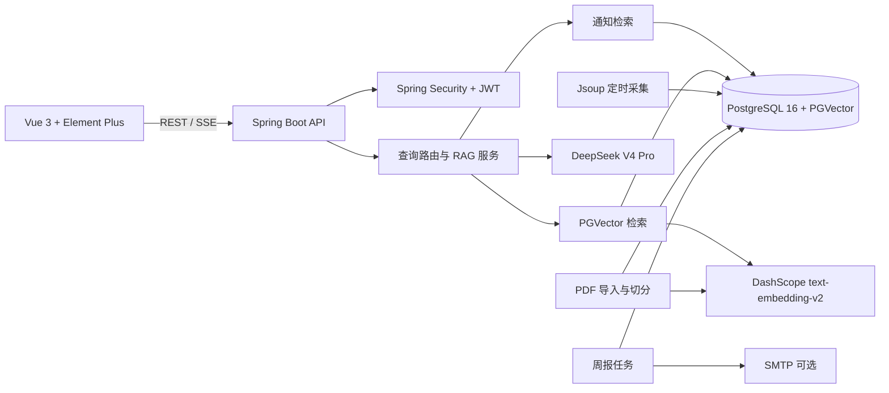

# 技术架构说明

## 1. 技术基线

采用 Spring Boot 3.5.8、Spring AI Alibaba 1.1.2.2 与 Java 17 字节码基线。该组合贴近 Spring AI Alibaba 1.1.2.x 所使用的 Boot 3.5.x / Java 17 基线；Spring Boot 3.5 系列官方系统要求兼容到 Java 25。当前开发机只有 Java 8，因此需要安装 JDK 17+ 后才能构建。Spring Boot 3.4 与 Java 25 不在官方兼容范围内，故作此调整。

- 前端：Vue 3、Element Plus、Vite。
- 后端：Spring Boot MVC、Spring Security、JWT、SSE。
- AI：DeepSeek V4 Pro Chat Completions 与 DashScope text-embedding-v2 通过服务端 Java HTTP 客户端调用，Embedding 为 1536 维；密钥仅从环境变量读取。Spring AI Alibaba 版本基线已记录，首版适配器暂未依赖其 ChatClient。
- 数据：PostgreSQL 16、PGVector、HNSW；Flyway 管理 schema。
- 网页：Jsoup 抓取与提取页面文本；PDFBox 提取 PDF 文本。
- 部署：Docker Compose 提供本地 PostgreSQL + pgvector。

## 2. 组件关系

## 3. 后端边界

- `auth`：注册、登录、当前用户和角色授权。
- `notice`：来源、通知查询、去重、定时采集及管理员触发。
- `knowledge`：PDF 提取、片段切分、向量生成、知识检索和引用。
- `chat`：会话权限、最近 20 轮上下文、查询时效路由、SSE 输出。
- `subscription`：用户与专区订阅关系及自然语言意图接口。
- `weekly`：周期内容聚合、站内周报、可选邮件投递。
- `admin`：来源与任务管理、知识导入、用户角色和运行摘要。

## 4. 数据与检索

业务表通过 Flyway 建立。向量表使用 `vector(1536)`，配置余弦距离与 HNSW。通知使用关系表存储原文与元数据；PDF 按制度/章节/条款边界切片，并保存 PDF 页码。查找通知优先使用专区、时间、关键词和标题过滤；政策问题使用 Embedding + PGVector，并补充关键词过滤。最终回答必须保留检索片段的来源标识。

在没有 DashScope key 的本地开发模式中，可以用本地轻量检索替代向量调用，但界面和文档必须说明这不是语义 Embedding。配置 DashScope 后再为 PDF 内容和查询生成真实向量。

## 5. 模型和密钥

- DeepSeek API：`https://api.deepseek.com`，模型标识 `deepseek-v4-pro`，配置项从环境变量读取。
- DashScope Embedding：单独配置 `DASHSCOPE_API_KEY`，不能假定 DeepSeek key 可用于 Embedding 服务。
- `.env` 本地文件加入 `.gitignore`；仓库仅保留空值 `.env.example`。
- 不读取、输出或提交 `DeepSeek_API_key.txt`。仅在首次真实模型联调前确认本地凭据配置，且不在聊天或日志打印 key。

## 6. 查询时效路由

为减少错误和无依据生成：

- “最新、今天、本周、近期、截止、报名、公告”等时效词优先查通知表。
- 校规、学籍、请假、教学流程等问题优先查 PDF 向量知识库。
- 混合问题组合两路结果并分别引用。
- 无检索结果时返回清楚的未命中说明。

后续可将规则路由升级为 Agent 工具调用，但底层检索工具应保持受控、可审计。

## 7. 身份和部署

首版自带本地账号，注册用户为学生；管理员由启动环境变量首次初始化。学校统一身份认证信息未提供，生产接入前需单独集成。邮件服务未配置时，只保存站内周报。生产部署需配置 HTTPS、备份、日志脱敏、任务重试、限流和密钥轮换。

## 8. 未决事项

1. 四个专区的正式命名与来源映射。
2. 学校登录/SSO 对接方式及管理员授权流程。
3. SMTP 服务、发件人和周报发送时间。
4. 生产部署目标及数据库托管方式。
5. 现有 377 页 PDF 中各制度的当前有效版本。
